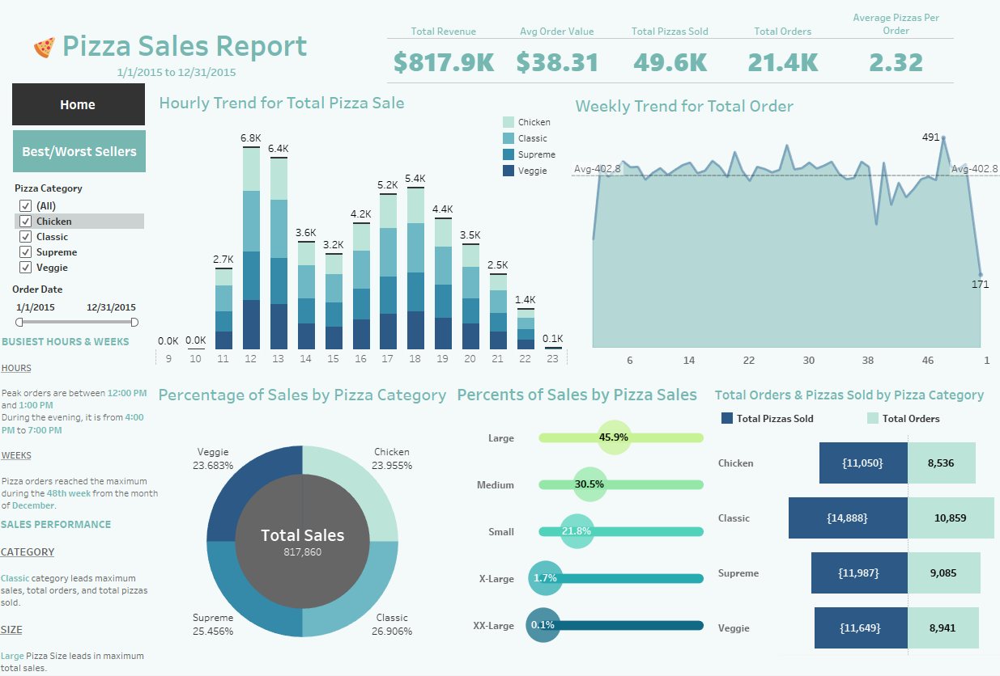
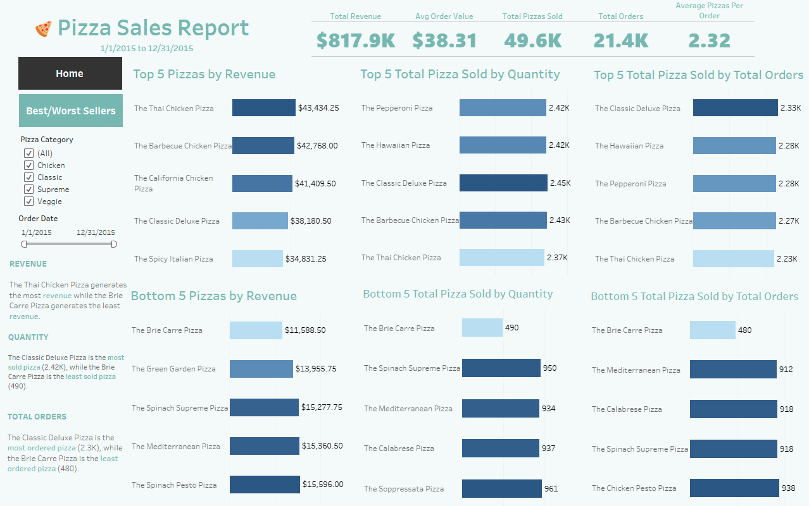

# PizzaHub Sales Analysis Report

## Background and Overview

PizzaHub is a fictitious pizza chain facing challenges in maximizing revenue and operational efficiency due to underutilized sales data. Despite recording transactional details like order times, pizza categories, and customer preferences, the company lacks a data-driven strategy to optimize its menu, staffing, and promotions.

This project analyzes 12+ key metrics—from hourly sales trends to product-level performance—using SQL queries and Tableau visualizations. The goal is to uncover actionable insights that drive decision-making for inventory management, marketing, and customer experience improvements.

### Key Analysis Areas:
1. **Sales Trends Analysis**
   - Revenue fluctuations and peak sales periods
   - Order volume trends (weekday vs. weekend)

2. **Product Performance**
   - Top/Bottom Performers by revenue and quantity

3. **Time-Based Demand**
   - Hourly trends
   - Weekly patterns

4. **Customer Behavior Insights**
   - Average pizzas per order

[Download Interactive Tableau Dashboard](https://public.tableau.com/app/profile/jason.guan4557/viz/PizzaSalesProject_17427741073350/Home) | [View SQL Queries](PizzaDBquery.sql)

---

## Executive Summary

 

Following peak sales in Week 48 (December), PizzaHub experiences a significant post-holiday slump, with January's Week 1 recording the lowest sales volume of the year.

### Sales Trends
**Declines:**
- Week 1 sales drop 40% below December averages
- Order volume falls by 25% in January compared to Q4 peaks

**Peaks:**
- December (Week 48) drives 30% higher revenue than average weeks
- Daily demand surges between 12:00-1:00 PM and 4:00-7:00 PM (55% of daily revenue)

### Performance Trends
**Product Wins:**
- Classic Pizza dominates sales (38% of revenue)
- Large Pizzas generate 52% of total sales

**Underperformers:**
- Bottom 5 Pizzas account for just 3% of revenue
- Medium Pizzas trail Large sizes by 24% in revenue contribution

### Strategic Imperatives
1. Counter Seasonal Dips with "New Year Specials"
2. Leverage Peaks with combo deals
3. Optimize product bundles

---

## Insights Deep Dive

### Sales Trends
**Hourly Order Volume:**
- 12 PM: 6.8K orders (peak)
- 1 PM: 6.4K orders
- 6 PM: 5.4K orders (dinner peak)
- 11 PM: 100 orders (lowest)

**Weekly Sales Trends:**
- Week 48 (Dec): 491 orders (peak)
- Week 1 (Jan): 171 orders (lowest)

### Performance Trends
**Pizza Categories:**
- Classic: 26.9% of revenue
- Supreme: 25.45%
- Chicken: 23.95%
- Veggie: 23.7%

**Pizza Sizes:**
- Large: 45.9%
- Medium: 30.5%
- Small: 21.8%
- XL: 1.7%
- XXL: 0.1%

**Top 5 Pizzas by Revenue:**
1. Thai Chicken ($43K)
2. BBQ Chicken ($42.7K)
3. California Chicken ($41K)
4. Classic Deluxe ($38K)
5. Spicy Italian ($34K)

**Bottom 5 Pizzas by Revenue:**
1. Brie Carré ($11.5K)
2. Green Garden ($14K)
3. Spinach Supreme ($15K)
4. Mediterranean ($15K)
5. Spinach Pesto ($15.5K)

---

## Recommendations

### 1. Maximize Peak Hour Sales
**Lunch Rush (12-1 PM):**
- Introduce "Quick Lunch Combos" (personal pizza + drink) for $8.99
- Schedule 25% more staff from 11:30 AM-2 PM

**Dinner Peak (5-7 PM):**
- Launch "Family Dinner Deal" (2 Large pizzas + 2 sides) at 15% discount
- Add premium toppings as upsells

### 2. Address January Sales Slump
- Offer "New Year Kickoff" coupon (20% off first January order)
- Create limited-time winter specials

### 3. Optimize Menu Performance
**Top Sellers:**
- Feature Thai Chicken and BBQ Chicken in bundles
- Highlight Classic Deluxe as "Most Popular"

**Underperformers:**
- Remove Brie Carré or test as "Weekend Special"
- Bundle Spinach Supreme with bestsellers

### 4. Leverage Pizza Size Trends
- Push Large size upgrades at checkout
- Reduce XXL inventory

### 5. Targeted Promotions
- Weekend Specials: "Buy 1 Large, Get 1 Free" on Saturdays
- Holiday Prep: Stock 20% more ingredients for Week 48
